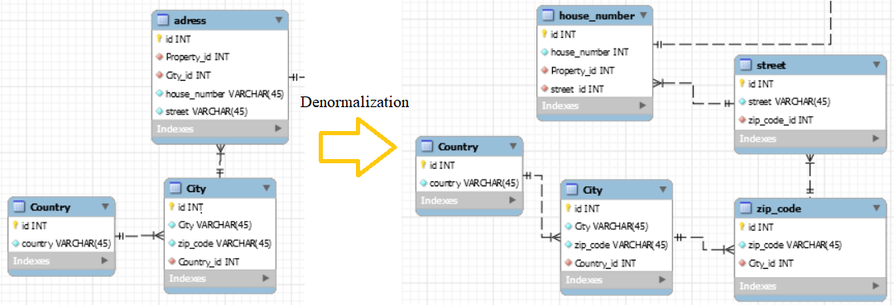

# Estate-agency-data-base
Data base in SQL

## Entity–relationship model:
 SQL code for creating data base can be found in CreateDB.sql file.

  

## Filling data base with random data:
CREATE PROCEDURE `fill_person` (IN no_persons (1000))
BEGIN
   ...
END

ALL tables that do not contain foreign keys were filled. For all tables containing foreign keys, cursors was be used. Cursors allow us to move over existing tables in tables. So if we want to fill out the Account table that contains the foreign key of the Person table, we can create a cursor:

DECLARE person_cur CURSOR FOR SELECT `id_person` FROM` mydb`.`Person`;

With this cursor, we can iterate through all the entries in the Person table within the procedure for filling the Account table. This means that we can create an account for each person. If we use another loop for the number of accounts within this loop, we can create multiple accounts for each person.

## Optimalization:
Denormaliation was processed to speed up queries time. Adress was converted as follows:

  

## Secondary Keys
Four specific sql queries was created to use a few secondary indexes.
1. Display information about estate agent whos age is 30, property sold by him is 146012 and works in office named JohnCompany.
2. Disply countries with number of properties (enought to connect house_number table, cause one house number -> one property ) and number of street in the country.
3. Show names, surnames and phone numbers from thoes property owners who have at least one property 130 squere meters
surrounded by 2 lakes and 4 parks
4. Show esatet agent named "name1" with property sold for the most from properties having at least 100 squere meters ONE INDEX(NAME)

  

